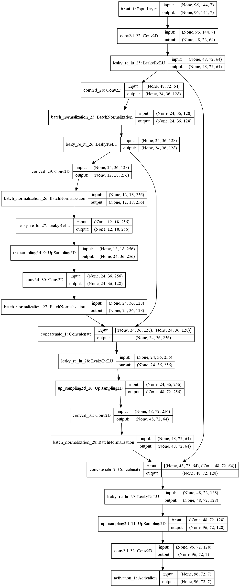
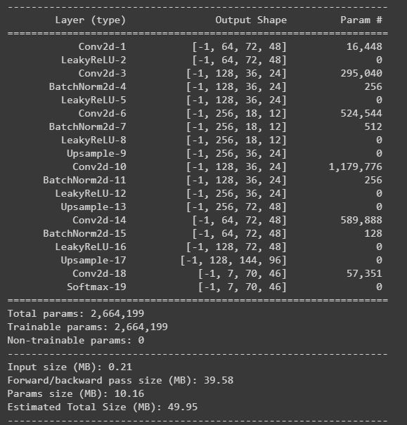
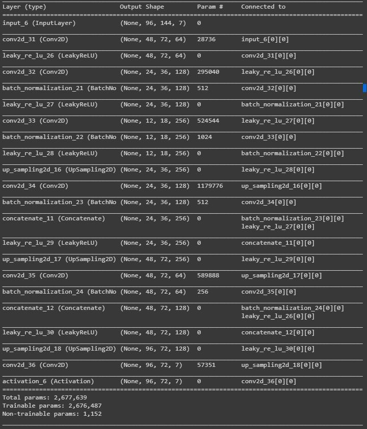

# Bird-Eye-View

ECE Paris senior year project.

Aiming at creating a bird-eye view from the surroundings of a car, based on cameras images with segmantic segmentation placed on the car.

## Progress 
- [x] Implementing first model in PyTorch
- [x] Importing and preprocessing data (by using already existing data, or exporting data from Carla on our own)
- [x] Testing first model
- [x] Implementing other NN architecture
- [x] Compare the results
- [ ] Implement other features 

## Issue  

 - problem to convert the parameter from Keras to Pytorch (especially padding:'same'):
 
__Issue details:__ 'Same' padding means the size of output feature-maps are the same as the input feature-maps (under the assumption of  stride=1 ). For instance, if input is  nin  channels with feature-maps of size  28×28 , then in the output you expect to get  nout  feature maps each of size  28×28  as well. Somehow, Pytorch does not has this option. 
__Solution :__ 
with W:input volume size, F:kernel size, S:stride, P:amount of padding we have this formula output volume = (W-F+2P)/S+1

## Data

Our Data will be provided by the CARLA simulator.
More details incoming later.

## Model

We are currently rebuilding 3 models from [this repository](https://github.com/MankaranSingh/Auto-Birds-Eye), using PyTorch Library.

	
 Deeper Autoencoder (Davide) (click to expand) 

	
 Autoencoder (Loïc) (click to expand) 

	
 Unet (Rémi) (click to expand) 

 

Comparaison après implémentation en PyTorch/Implémentation initiale avec Keras: 
 

## Loss Functions

	

 
	### SSIM (Structural Similarity Index) 

C'est une métrique qui permet de mesurer la similarité de structure de deux images (plutôt qu’une différence pixel à pixel). Elle est utilisée en tant que « loss function », en prenant en compte la luminance, le contraste et la structure. Permet de mesurer la qualité d’une image compressée par rapport à l’image originale. Vise à reproduire la vision humaine.
Performances : semble être peu précis (moins que prévu) et conçu comme une mesure de qualité d’images fixes.

	Dice-Coefficient Loss (region-based)

Ce coefficient est un indicateur statistique qui mesure la similarité entre deux échantillons. Souvent comparée à la Cross-Entropy : l’objectif est de maximiser la mesure du coefficient Dice. L’entropie croisée n’est qu’une approximation et est plus facile à maximiser en utilisant la rétropropagation. De plus, le coefficient Dice est plus performant pour les problèmes de déséquilibre de classe par conception (c’est un problème de classification : les classes ne sont pas représentées de manière égales, ce qui augmente les difficultés d’apprentissage de l’algorithme).

	
	Cross-Entropy Loss (distribution-based)

Mesure la performance d’un modèle dont la sortie est une valeur de probabilité située entre 0 et 1, en mesurant la distance entre la valeur prédite et la valeur réelle. Plus la valeur prédite s’écarte de la valeur réelle, plus la « Cross-Entropy Loss » augmente : ainsi, un modèle parfait aurait une perte de 0. Le score associé à chaque probabilité est calculé à partir d’un logarithme : ainsi, plus les grandes différences proches de 1 le score est élevé et les petites différences proches de 0 obtiennent des scores faibles. 

De manière générale, on ne peut pas prédire quelle fonction sera la plus efficace sur un set de données particulier, la meilleure solution est donc de toutes les tester et de comparer les résultats.

	Custom Loss-Function

Définie sous le nom "Custom_loss", il s'agit d'une Loss Function créée par l'auteur du Github et déclarée comme une combinaison de la Dice-Coefficient et de la SSIM :
Custom_loss = Dice_coef + 5 * SSIM_loss
Une explication peut venir de l'architecture des Autoencodeurs. De manière idéale, un modèle Autoencodeur offre un juste milieu entre :
- Une sensibilité aux données en entrée pour reconstruire la représentation de manière assez précise.
- Une insensibilité aux données en entrée pour "décourager" le modèle à mémoriser les entrées et donc éviter un surchargement.
Ainsi, on oblige le modèle à ne conserver que les variations de données nécessaires à la reconstruction de l'image et éviter les redondances. Pour ce faire, il faut construire une Loss Function avec un terme qui sensibilise le modèle aux données en entrée (ici le Dice_coef) et on y ajoute un terme de décourager le modèle appelé "régularisateur" (ici le SSIM_loss). De plus, on introduit un facteur d'échelle devant le régularisateur pour gérer l'équilibre entre les deux objectifs (ici on utilise 5) [1].

[1] Jeremy Jordan «Introduction to Autoencoders». 19 March 2018. Jeremyjordan.me
https://www.jeremyjordan.me/autoencoders/

## Intégration à Carla (Windows)

Une fois que les réseaux de neurones ont été retranscrits et entraînés, nous avons souhaité les intégrer au simulateur Carla pour obtenir une évolution en temps réel de la Bird-Eye View. Afin de reproduire cette caméra, il suffit de télécharger les fichiers suivants et de les placer dans un même dossier : 
- "BEV_carla.py" script Python permettant d'afficher la Bird-Eye View.
- "utilBEV.py" script Python permettant d'appliquer les transformations nécessaires sur les données en entrée du réseau.
- "autoencoder.py" script Python contenant le réseau de neurone de type Autoencoder.

Ensuite il vous faut lancer le simulateur Carla et attendre que le logiciel se charge complètement.
Une fois que Carla est lancé, ouvrez l'invite de commande (cmd) et placez vous dans le dossier où se trouvent vos scripts téléchargés.
Finalement, lancez la commande suivante : "python BEV_carla.py".

Attention : il arrive très souvent que cela ne marche pas du premier coup (erreur de connexion à Carla), il vous faut alors réessayer plusieurs fois avant que ça marche.

By [Davide](https://github.com/Davide-gtr), [Loic](https://github.com/Loicmag) and [Rémi](https://github.com/Wardmisp)
