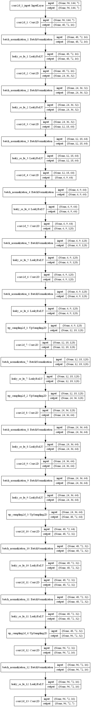
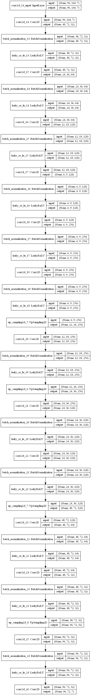

# Bird-Eye-View

ECE Paris senior year project.

Aiming at creating a bird-eye view from the surroundings of a car, based on cameras placed on the car.

##Data

Our Data will be provided by the CARLA simulator.
More details incoming later.

##Model

We are currently rebuilding 3 models from [this repository](https://github.com/MankaranSingh/Auto-Birds-Eye), using PyTorch Library.

Model 1 : 

Model 2 : 

Model 3 : 

By [Davide](https://github.com/Davide-gtr), [Loic](https://github.com/Loicmag) and [Rémi](https://github.com/Wardmisp)